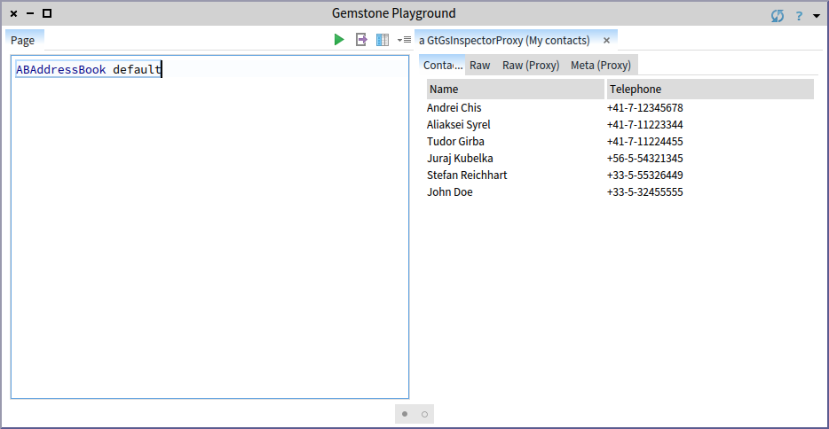
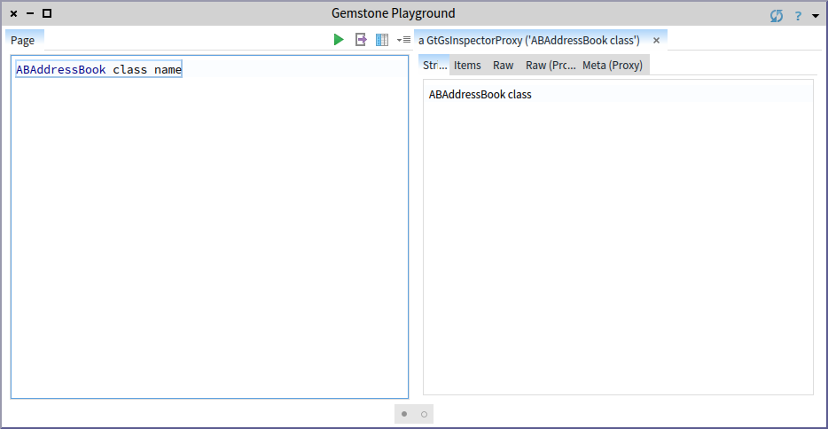

# gt4gemstone
gt4gemstone is the Glamorous Toolkit for remote work with Gemstone/S. It is a project developed by feenk.com.

## Installation

After installing [GsDevKit](https://github.com/GsDevKit/GsDevKit_home#installation), do the following from the $GS_HOME folder to install the latest version:

    createStone -u http://ws.stfx.eu/4TIV0I28KZ6O?format=text -i Gt4Gemstone -l Gt4Gemstone Gt4Gemstone33 3.3.0
    createClient -t pharo Gt4Gemstone -l -v Pharo5.0 -z $GS_HOME/shared/repos/gt4gemstone/.smalltalk.ston
    startClient Gt4Gemstone -s Gt4Gemstone33

The current stable version is 0.1. To install it use the following instructions after installing [GsDevKit](https://github.com/GsDevKit/GsDevKit_home#installation):

    createStone -u http://ws.stfx.eu/ARUCDMZCLM7J?format=text -i Gt4Gemstone -l Gt4Gemstone Gt4Gemstone33 3.3.0
    createClient -t pharo Gt4Gemstone -l -v Pharo5.0 -z $GS_HOME/shared/repos/gt4gemstone/.smalltalk.ston
    startClient Gt4Gemstone -s Gt4Gemstone33

##Opening a GT Gemstone remote Playground

Open a Pharo Playground and execute:

    gtClient := GtGsMinimalClient forDefaultSessionDescription.
    gsPlayground := (GtGsPlayground forGemstoneClient: gtClient).
    gsPlayground openEmpty.

This opens a specialized Playground that works remotely with Gemstone. You can see that it is distinct because it has a blue border.

##Screenshots

##Utility scripts

Updating the code of gt4gemstone in a Gemstone stone:

    gtClient := GtGsMinimalClient forSessionDescriptionNamed: SCIGemStoneServerConfigSpec defaultSessionName.
    gtClient evaluateCommandStream: 'project load Gt4Gemstone' readStream .
    gtClient evaluateCommandStream: 'commit' readStream.

Evaluating and inspecting a remote command:

    gtClient performStringRemotelyAndInspect: '40+2'.
