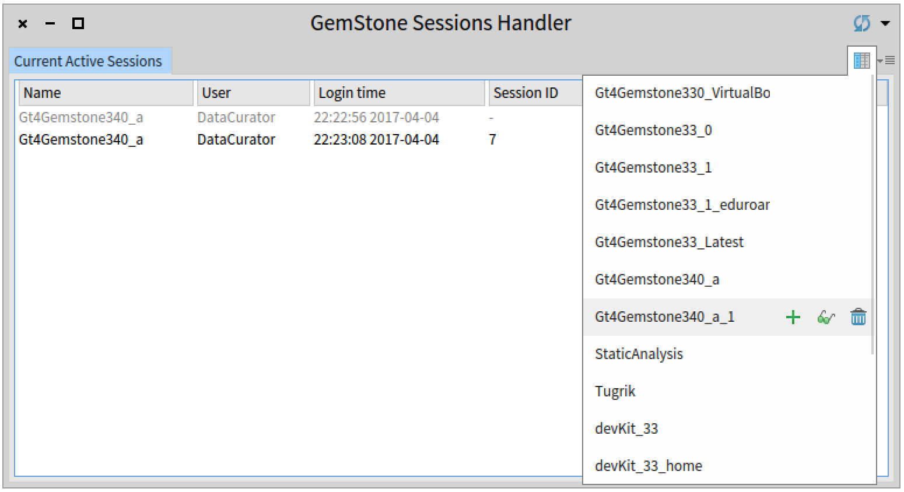
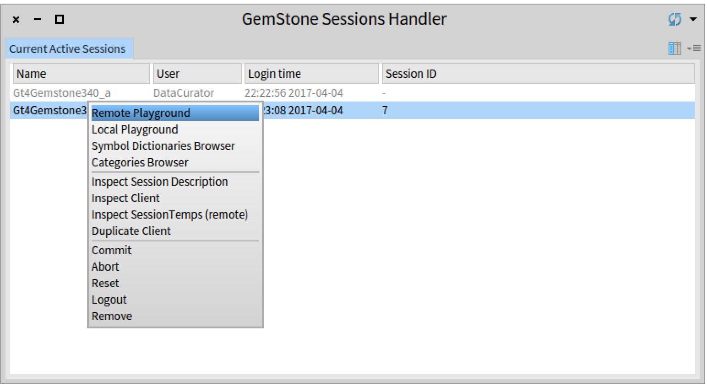
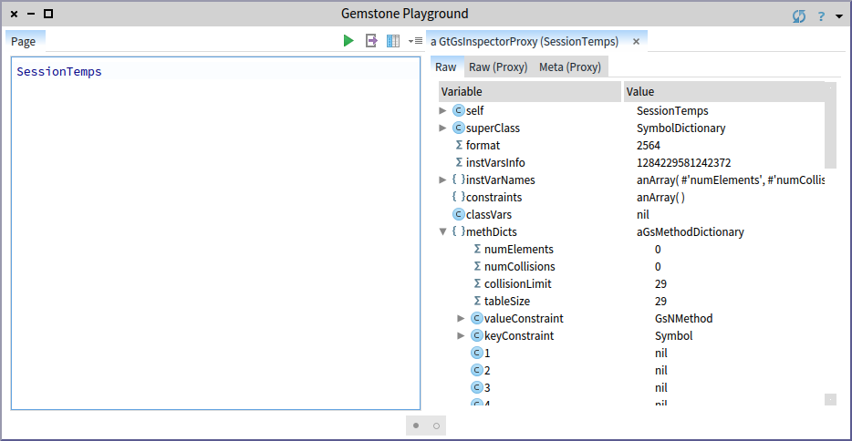
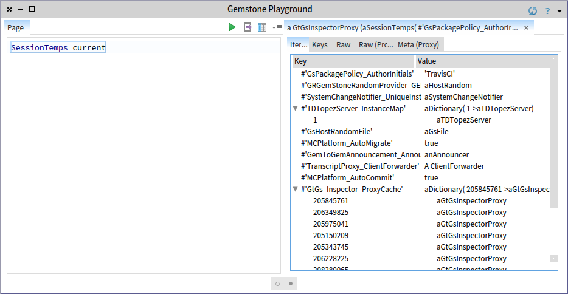
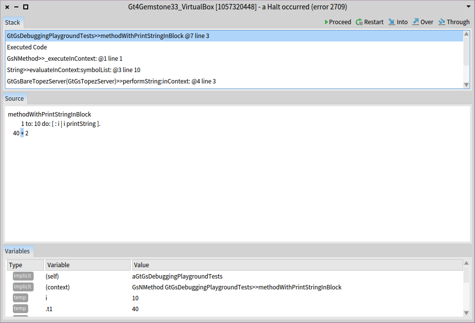
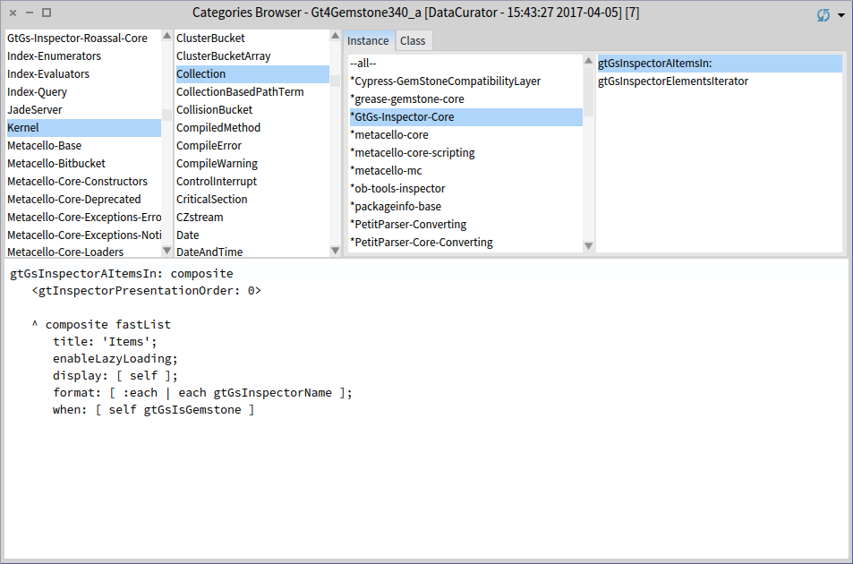
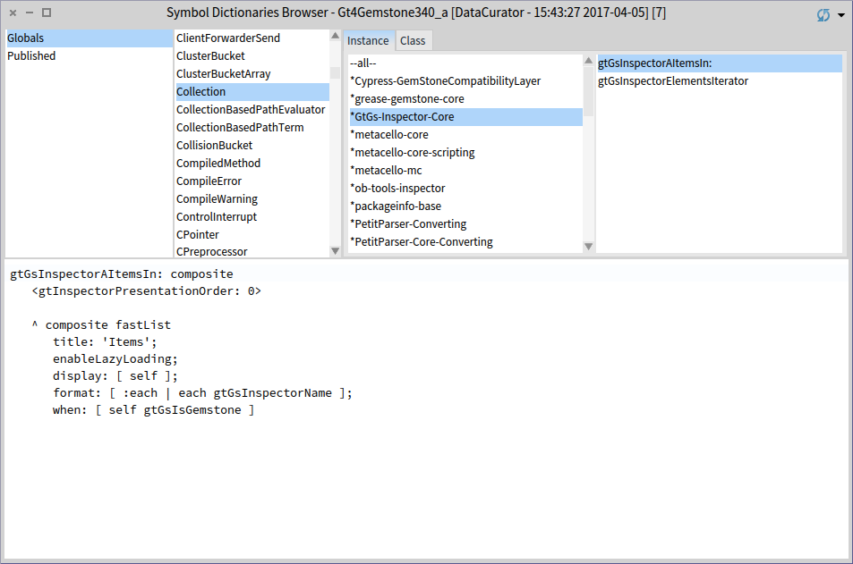
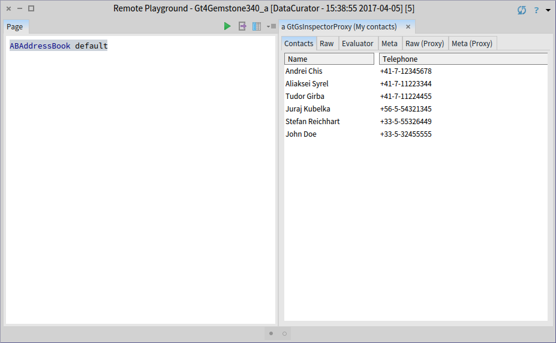
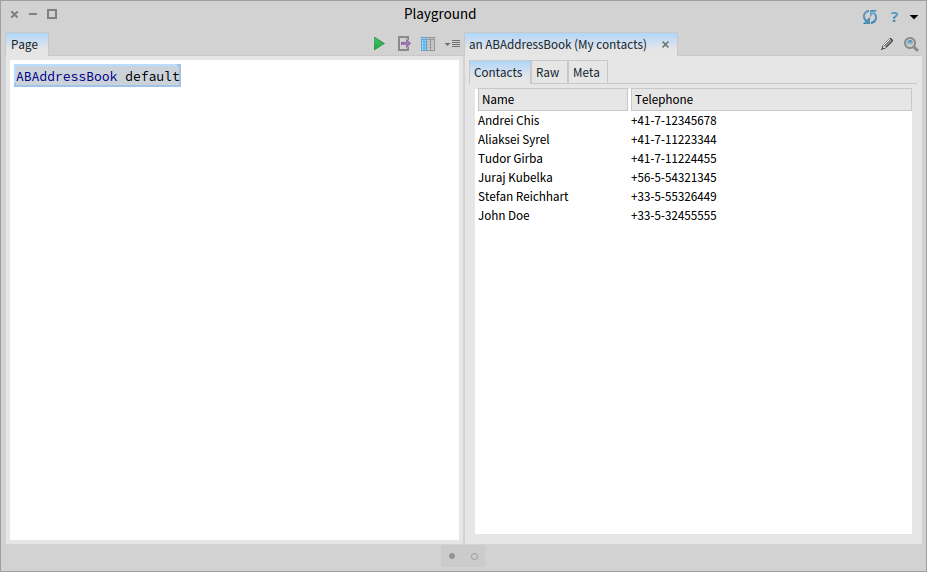

# gt4gemstone 
gt4gemstone is the Glamorous Toolkit for remote work with Gemstone/S. It is a project developed by feenk.com.

## Installation

The gt4gemstone tools require code to be installed both on the client and on the server images.
To create a new client containing the latest version, after installing [GsDevKit](https://github.com/GsDevKit/GsDevKit_home#installation), do the following from the $GS_HOME folder:

    cd $GS_HOME/shared/repos
    git clone https://github.com/feenkcom/gt4gemstone.git
    createClient -t pharo Gt4Gemstone -l -v Pharo5.0 -s gs_333 -z $GS_HOME/shared/repos/gt4gemstone/.smalltalk.ston
    startClient Gt4Gemstone -s Gt4Gemstone

For creating a new stone containing the latest version use:

    createStone -u http://ws.stfx.eu/4TIV0I28KZ6O?format=text -i Gt4Gemstone -l Gt4Gemstone Gt4Gemstone 3.3.3

For installing gt4gemstone in a stone that has GsDevKit installed see [gt4gemstone server instalation using GsDevKit](doc/gsdevkitGemStoneInstallation.md).

For installing gt4gemstone in a stone doesn't have GsDevKit see [gt4gemstone server instalation without GsDevKit](doc/bareGemStoneInstallation.md). 

For installing and configuring GsDevKit on Windows see [GsDevKit Windows Installation](doc/windowsGsDevKitInstallation.md).

Once you installed gt4gemstone you can take at a look at some [examples](doc/basicCodeSnippets.md) of how to use a gemstone client.

## Connecting to a stone

gt4gemstone comes with a session manager that can be opened from the World menu. This manager allows you to create connections to stones based on session descriptions. By default it uses the session descriptions present in the GsDevKit installation.

## Remote Playground

A remote Pharo Playgrond that works on a remote stone is created using the context menu of a selected session. This playground has a distinct blue border and provides actions for executing and inspecting code remotely.

Alternatively opening a Pharo Playground can be achived using the following API:

    gtClient := GtGsMinimalClient forDefaultSessionDescription.
    gsPlayground := (GtGsPlayground forGemstoneClient: gtClient).
    gsPlayground openEmpty.
    
## Inspecting objects

gt4gemstone further comes with a moldable inspector that allows you to inspect objects using multiple presentations.
    

    
## Debugger & Editor

## Custom object view

gt4gemstone uses GTInspector and allows every object to have multiple views. A similar API can be used to create views for Pharo and GemStone objects. For example, an `AddressBook` object can have a view to show the list of contacts from the address book. The following code creates this view both for an `AddressBook` object stored either in Pharo or GemStone:

    gtGsInspectorAContactsOn: aComposite
	   <gtInspectorPresentationOrder: 5>
	
	   aComposite table
          title: 'Contacts';
          display: [ self contacts ];
          column: 'Name' evaluated: [ :aContact | 
             aContact fullName ] width: 150;
          column: 'Telephone' evaluated: [ :aContact | 
             aContact address telephone fullNumber ]

The first screenshot shows this view on an instance of an `AddressBook` object stored in GemStone and the second on an instance from Pharo:

## Utility scripts

Updating the code of gt4gemstone in a Gemstone stone:

    gtClient := GtGsMinimalClient forSessionDescriptionNamed: SCIGemStoneServerConfigSpec defaultSessionName.
    gtClient evaluateCommandStream: 'project load Gt4Gemstone' readStream .
    gtClient evaluateCommandStream: 'commit' readStream.

Evaluating and inspecting a remote command:

    gtClient performStringRemotelyAndInspect: '40+2'.
